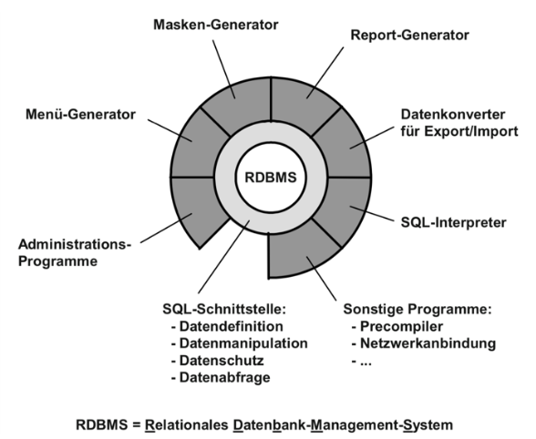
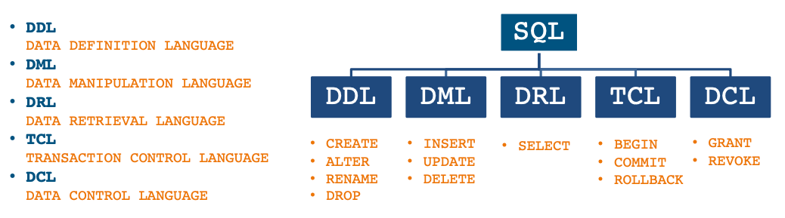

# Modul 106 LB1

**Teilnehmer**: Arlind Sulejmani, Harun Siyad, Maximilian Kos

**Kursleiter**: Damien Vouillamoz

## 1. Aufgabe 1.1 Datenbankmodelle und Datenbanktheorie

### 1.1. Hierarchische Datenbank

- Hierarchische Speicherung der Daten in einem sequenziellen File (Land, Kanton, Ort/Ort, Bezirk, Gemeinde, Strasse, Hausnummer, Name, Vorname, Geburtsdatum
- Neue Daten erfordern ein umkopieren, sortieren der Daten/File

### 1.2. Relationale und Objektrelationale Datenbanken

- Objekt(-relationale) Datenbanken erlauben benutzerdefinierte Datentypen und Objekte - Daten werden in Themenkreisen (Entitäten) in Form von Tabellen gespeichert
- Flexibler als Hierachische Datenbanken
- Daten verschiedener Tabellen sind unabhängiger
- Einfach erweiterbar
- Unübersichtlicher und schwerfälliger

### 1.3. Objektorientierte Datenbank

- Objket steht im Zentrum nicht die Tabelle
- Beinhaltent auf Methoden um Daten zu ändern
- Immer noch im Nischendasein

### 1.4. Datenbanktheorie zu relationalen Datenbanken

Eine relationale Datenbank:

- verwaltet Daten strukturiert und überschaubar
- regelt den Zugriff auf Datensätze
- bietet Schnittellen zur flexiblen Interaktion durch externen Applikationen
- speichert Daten nicht redundant
- gewährleistet die Datenintegrität
- gewährleistet die Referenzielle Integrität



### 1.5. Datenbanksprache SQL

Die Datenbanksprach besitzt vier Elemente:

1. Datendefinition **(DDL, Data Definition Language)**
2. Datenmanipulation **(DML, Data Manipulation Language)**
3. Datenabfrage **(DRL, Data Retrieval Language)**
4. Datenschutz (**DSL, Data Security Language)** —> <br>
Besteht aus **TCL (Transaction Control Language)** und **DCL (Data Control Language)**



## 2. Aufgabe 1.2 Repetitionsfragen lösen

1. Was ist eine Relationale Datenbank?
   - Eine relationale Datenbank ist eine Art von Datenbank, die Daten in Tabellen speichert, die über Schlüsselwörter und Verknüpfungen miteinander verbunden sind. Dies ermöglicht ein schnelleres und genaueres Abrufen von Informationen. Stellt referenzierte Integrität sicher. Datentypen müssen bei Einträgen eingehalten werden.

2. Nennen Sie drei verschiedene relationale Datenbank Management Systeme DBMS?
   - MySQL
   - Microsoft SQL Server
   - Oracle Database

3. Welche Aufgaben erfüllt ein DBMS für Sie als Entwickler?
   - Verwaltung und Speicherung von Daten in einer Datenbank
   - Ermöglicht den Zugriff auf die Datenbank durch Abfragen und Aktionen mittels einer Abfragesprache
   - Bietet Werkzeuge zur Verwaltung und Verwaltung der Datenbankstruktur, wie z.B. Erstellung, Änderung und Löschen von Tabellen.

4. Wie greifen Benutzer (keine Entwickler) auf eine Datenbank zu?
   - Benutzer greifen auf eine Datenbank über eine Benutzeroberfläche (**GUI**) zu, die ihnen ermöglicht, Daten einzugeben, abzufragen, anzuzeigen und zu bearbeiten.
   - Benutzer können auf die Datenbank über eine Anwendung (z.B. ein Programm oder eine Website) zugreifen, die speziell für den Zugriff auf die Datenbank entwickelt wurde.
   - Benutzer können auf die Datenbank über Abfragesprachen (z.B. SQL) direkt zugreifen, wenn sie über die notwendigen Kenntnisse und Berechtigungen verfügen.

5. Handelt es sich bei SQL um eine Programmiersprache? **(NEIN)**
   - SQL (Structured Query Language) ist eine spezielle Abfragesprache, die entwickelt wurde, um Daten in relationalen Datenbanken zu verwalten und abzufragen.
   - SQL ist keine allgemeine Programmiersprache, sondern eine Domänen-spezifische Sprache, die ausschließlich für die Arbeit mit Datenbanken verwendet wird.
   - SQL wird verwendet, um Aktionen wie Einfügen, Aktualisieren, Löschen und Abfragen von Daten in einer relationalen Datenbank durchzuführen.

6. Ist die Sprache SQL auf allen Datenbanken gleich?
   - SQL ist eine standardisierte Abfragesprache, die von vielen Datenbankmanagementsystemen unterstützt wird.
   - Allerdings gibt es Unterschiede in der Implementierung von SQL zwischen verschiedenen Datenbanken, insbesondere in Bezug auf erweiterte Funktionen und Erweiterungen.
   - Einige Datenbanken haben ihre eigene Variante der SQL-Sprache, die speziell für die Verwendung mit dieser Datenbank optimiert wurde, wie z.B. T-SQL(Transact-SQL) von Microsoft SQL Server.

7. Was versteht man unter NoSQL Datenbank?
   - NoSQL Datenbanken sind Datenbanken, die nicht auf die relationale Datenmodellierung und die Verwendung von SQL als Abfragesprache setzen.
   - NoSQL Datenbanken verwenden andere Datenmodelle wie Dokument, Schlüssel-Wert, Graf oder Column-Family-basiertes Modell.
   - NoSQL Datenbanken sind in der Lage, mit großen und unstrukturierten Datenmengen umzugehen und sind somit für Anwendungen mit hohen Anforderungen an Skalierbarkeit und Verfügbarkeit geeignet.

8. Nennen Sie drei NoSQL Datenbanksysteme?
   - MongoDB
   - Cassandra
   - Redis

9.  Was versteht man unter Datenbank Schema?
    - Ein Datenbank-Schema beschreibt die Struktur und Organisation von Daten in einer Datenbank.
    - Es enthält die Definitionen von Tabellen, Spalten, Indizes, Beziehungen und anderen Strukturelementen der Datenbank.
    - Es legt die Regeln und Einschränkungen fest, die die Daten in der Datenbank einhalten müssen, um die Integrität der Daten zu gewährleisten.

10. Wozu dient ein Entity Relationship Model (ERM)?
    - Ein Entity Relationship Model (ERM) dient dazu, die Beziehungen zwischen Entitäten in einer Datenbank zu beschreiben und darzustellen. Es hilft dabei, komplexe Datenstrukturen zu verstehen und zu analysieren.

11. Wie sieht ein Enhanced Entity Relationship (EER) Model aus?
    - Ein Enhanced Entity Relationship (EER) Model ist ein Modell zur Visualisierung des Konzepts der Datenbankstruktur. Es besteht aus Entitäten, Beziehungen und Attributen, welche darstellen, wie die Entitäten miteinander in Beziehung stehen und wie die Attribute jeder Entität definiert sind.

12. Was bedeuten die Begriffe: Entität, Attribut und Tupel?
    - **Entität**: Eine Entität ist ein Objekt, eine Person, ein Konzept oder ein Ereignis, das relevantes Wissen oder Daten besitzt und in einer Datenbank oder einem Datenmodell verarbeitet wird.
    - **Attribut**: Ein Attribut ist ein Merkmal oder ein Eigenschaft einer Entität, das spezifische Informationen über die Entität enthält.
    - **Tupel**: Ein Tupel ist eine Sammlung von Attributen, die zu einer Entität gehören. Es kann mehrere Attribute enthalten, die zusammenarbeiten, um eine einzelne Entität zu beschreiben.

13. Was versteht man unter Datenkonsistenz?
    - Datenkonsistenz bezieht sich auf die Richtigkeit und Vollständigkeit von Daten in einer SQL-Datenbank.
     - Datenkonsistenz bedeutet, dass die Daten in einer Datenbank korrekt und vollständig sind und dass sie sich nicht widersprechen.

14. Was bedeutet Redundanz im Zusammenhang mit einer Datenbank?
    - Redundanz bedeutet, dass eine Datenbank mehr Daten als nötig speichert, um sicherzustellen, dass jede benötigte Information verfügbar ist und die Integrität der Daten gewährleistet ist.

15. Was versteht man unter Normalform?
    - Die Normalform ist ein Kriterium für den Aufbau einer relationalen Datenbank. Es beinhaltet die Unterteilung von Tabellen in mehrere kleinere Tabellen, die jeweils ein spezifisches Merkmal enthalten, und die Verknüpfung dieser Tabellen mittels Fremdschlüssel.

16. Wie unterscheiden sich die erste, zweite und dritte Normalform?

    - Die erste Normalform (1NF) besagt, dass alle Elemente in einer Tabelle einzelne Werte enthalten müssen und dass jede Spalte einen einzelnen Wert enthalten muss.
    - Die zweite Normalform (2NF) erfordert, dass jedes Nicht-Schlüsselfeld in einer Tabelle vollständig durch den Primärschlüssel oder einen eindeutigen Kombinationsschlüssel determiniert wird.
    - Die dritte Normalform (3NF) erfordert, dass jedes Nicht-Schlüsselfeld in einer Tabelle nur durch den Primärschlüssel determiniert wird und keine anderen Schlüsselfelder referenziert werden.

17. Was versteht man unter Primär- und Fremdschlüssel?

    - Der Primärschlüssel ist ein eindeutiger Schlüssel, der jeder Zeile einer Tabelle zugeordnet ist. 
    - Der Fremdschlüssel ist ein Schlüssel, der eine Zeile in einer Tabelle mit einer Zeile in einer anderen Tabelle verknüpft.

18. Was ist referentielle Integrität?
    - Referentielle Integrität ist ein Datenbanksystem, das sicherstellt, dass Daten nicht versehentlich oder absichtlich verändert oder gelöscht werden. Es schützt die Daten vor unerlaubten Änderungen, indem es Verbindungen zwischen Tabellen herstellt und Änderungen an den Daten validiert, bevor sie in der Datenbank gespeichert werden.

19. Was bringt Object-Relational Mapping (ORM)?
    - ORM ermöglicht die Abbildung relationaler Datenbanken in objektorientierte Programmiersprachen. Es vereinfacht den Zugriff auf Datenbanken, da keine SQL-Befehle verwendet werden müssen, sondern die Datenbanken direkt über den Code angesprochen werden können.

20. Wie unterscheiden sich die Datentypen Char und Varchar?
    - Der Datentyp Char speichert konstante Zeichenketten einer festen Länge, während der Datentyp Varchar Variable-Längen-Zeichenketten speichert.

21. Was ist ein Character Set und wie unterscheiden sich ASCII, LATIN1 und UTF-8?
    - Ein Character Set ist eine Sammlung von Symbolen und Zeichen, die einem bestimmten Zweck dienen.

    - ASCII (American Standard Code for Information Interchange) ist ein 7-bit-Code, der zur Darstellung von Texten in Englisch verwendet wird.

    - LATIN1 (ISO-8859-1) ist ein 8-bit-Code, der zur Darstellung von Texten in Westeuropa verwendet wird.

    - UTF-8 (Unicode Transformation Format 8-bit) ist ein 8-bit-Code, der für die Darstellung von Texten in verschiedenen Sprachen verwendet wird.

22. Wie unterscheiden sich die Datentypen Integer und Float?
    - Integer-Variablen speichern ganzzahlige Werte, während Float-Variablen Gleitkommazahlen speichern.

23. Wozu verwendet man den Datentyp Decimal?
    - Der Datentyp Decimal wird verwendet, um finanzielle Werte zu speichern.

24. Wie unterscheiden sich die Datentypen Timestamp und Datetime?
    - Der Timestamp-Datentyp speichert eine einzelne Zeitangabe als Ganzzahl, während der Datetime-Datentyp speichert eine kombinierte Datum und Uhrzeitangabe als Zeichenfolge.

25. Wie unterscheiden sich 0 und NULL?
    -  0 ist eine Zahl, die als Wert 0 dargestellt wird, während NULL als leerer Wert in Programmiersprachen verwendet wird. In der Datenbank wird NULL als fehlender Wert definiert, der keinen Wert hat.

## 3. Aufgabe 1.3 Erste Schritte mit MariaDB

- Hilfe anzeigen
```SQL
mysql> \?
```

- Liste aller Datenbanken anzeigen
```SQL
mysql> SHOW DATABASES;
```

- Mit einer bestimmten Datenbank verbinden
```SQL
mysql> USE mysql;
```

- Alle Tabellen anzeigen
```SQL
mysql> SHOW TABLES;
```

- Beschreibung (Struktur) einer Tabelle anzeigen
```SQL
mysql> DESCRIBE user;
mysql> DESC user;
```
## 4. Aufgabe 2.1 ERM des Datenbank Schemas entwerfen
SQL Script einfügen mit MariaDB mit <br>
`SOURCE C:/Users/User/Documents/scipt.sql`

```SQL
DROP DATABASE IF EXISTS `pizzashop`;
CREATE DATABASE `pizzashop`;
USE `pizzashop`;

CREATE TABLE `customer`(
    `id` INT NOT NULL AUTO_INCREMENT,
    `firstname` VARCHAR(45) NOT NULL,
    `lastname` VARCHAR(45) NOT NULL,
    `postcode` INT NOT NULL,
    `location` VARCHAR(45) NOT NULL,
    `email` VARCHAR(255) NOT NULL UNIQUE,
    `phone_number` VARCHAR(255) NOT NULL UNIQUE,
    PRIMARY KEY (`id`)
);

CREATE TABLE `order`(
    `id` INT NOT NULL AUTO_INCREMENT,
    `amount` INT NOT NULL,
    `order_date` DATETIME NOT NULL DEFAULT NOW(),
    `delivery_date` DATETIME,
    `fk_customer_id` INT NOT NULL,
    PRIMARY KEY (`id`),
    FOREIGN KEY (`fk_customer_id`) REFERENCES `customer`(`id`)
);

CREATE TABLE `product_category`(
    `id` INT NOT NULL AUTO_INCREMENT,
    `name` VARCHAR(45) NOT NULL,
    PRIMARY KEY (`id`)
);

CREATE TABLE `product`(
    `id` INT NOT NULL AUTO_INCREMENT,
    `description` TEXT NOT NULL,
    `price` DECIMAL(5,2),
    `fk_product_category_id` INT NOT NULL,
    PRIMARY KEY (`id`),
    FOREIGN KEY (`fk_product_category_id`) REFERENCES `product_category`(`id`)
);

CREATE TABLE `order_has_product` (
  `fk_order_id` INT NOT NULL,
  `fk_product_id` INT NOT NULL,
  FOREIGN KEY (`fk_order_id`) REFERENCES `order`(`id`),
  FOREIGN KEY (`fk_product_id`) REFERENCES `product`(`id`)
);
```

## 5. Aufgabe 2.4 Schema mit SQl/DDL bearbeiten

1. Sie wollen in der Kundentabelle auch die mobile Telefonnummer speichern. Fügen Sie eine entsprechende Spalte hinzu
    ```sql
    ALTER TABLE `customer` ADD `mobile` VARCHAR(255);
    ```
2. Ändern Sie den Namen der Spalte für die Produktbezeichung
    ```sql
    ALTER TABLE `product` CHANGE `name` `product_name` VARCHAR(255) NOT NULL;
    ALTER TABLE `product` CHANGE `product_name` `name` VARCHAR(255) NOT NULL;
    ```
3. Ändern Sie den Datentyp des Produktpreises auf DECIMAL(6,2) UNSIGNED
    ```sql
    ALTER TABLE `product` MODIFY `price` DECIMAL(6,2) UNSIGNED;
    ```
4. Setzten Sie nachträglich NOT NULL für den Produktpreis
   ```sql
    ALTER TABLE `product` MODIFY `price` DECIMAL(6,2) NOT NULL;
    ```
5. Fügen Sie ein neues Attribut (created_at, DATETIME) in die Produkttabelle ein und stellen Sie sicher, dass dieses Feld automatisch mit dem aktuellen Zeitpunkt bei einem INSERT befüllt wird.
   ```sql
    ALTER TABLE `product` ADD `created_at` DATETIME NOT NULL DEFAULT NOW();
   ```
6. Entfernen Sie die Spalte für die mobile Telefonnummer wieder
    ```sql
    ALTER TABLE `customer` DROP `mobile`;
    ```
7. Entfernen Sie den Foreign Key Constraint vom Postleitzahlen Fremdschlüssel aus der Kundentabelle
   ```sql
    SHOW CREATE TABLE `customer`; -- Name des CONSTRAINTs herausfinden (z.B. customer_ibfk_1)
    ALTER TABLE `customer` DROP CONSTRAINT `customer_ibfk_1`;
   ```
8. Fügen Sie den Foreign Key Constraint wieder hinzu
   ```sql
    ALTER TABLE `customer` ADD foreign key(`fk_zip_id`) REFERENCES `zip`(`id`);
    ```

## 6. Lernziele LB1

- Ich kenne die verschiedenen Arten von Datenbanken und deren hauptsächlichen Unterschiede
  - Relationale Datenbanken: Speichern Daten in Tabellen mit Beziehungen zwischen ihnen.
  - NoSQL-Datenbanken: Speichern Daten in Dokumenten, die keine Beziehungen zu anderen Dokumenten haben.
  - Objektorientierte Datenbanken: Speichern Daten in Objekten, die miteinander verknüpft sind.
  - Grafische Datenbanken: Speichern Daten in einem Netzwerk von Knoten und Kanten.
- Ich kenne die Aufgaben eines RDBMS sowie den Aufbau eines Datenbanksystems
  - **RDBMS**: Ein Relationales Datenbankmanagementsystem (RDBMS) ist ein Programm, mit dem Daten in einer relationalen Datenbank organisiert und gespeichert werden können. Das RDBMS ermöglicht es Benutzern, Daten zu erfassen, abzurufen, zu bearbeiten und zu ändern.
  - **Aufbau eines Datenbanksystems**: Ein Datenbanksystem besteht aus einer relationalen Datenbank, einer Datenbankmanagementsystem-Software (RDBMS) und einer Benutzer-Schnittstelle. Die relationale Datenbank ist eine Sammlung von Tabellen, in denen Daten gespeichert werden. Die RDBMS-Software verwaltet die Datenbank und stellt verschiedene Funktionen zur Verfügung, mit denen Benutzer auf die Daten zugreifen und sie verwalten können. Die Ben
- Ich kenne die verschiedenen Elemente der strukturierten Abfragesprache SQL

  - **SELECT** - Der SELECT-Befehl wird verwendet, um Daten aus einer Datenbank abzurufen.

  - **FROM** - Der FROM-Befehl wird verwendet, um eine Tabelle oder mehrere Tabellen auszuwählen, aus denen Daten abgerufen werden sollen.

  - **WHERE** - Der WHERE-Befehl wird verwendet, um bestimmte Kriterien für die Datenabfrage auszuwählen.

  - **ORDER BY** - Der ORDER BY-Befehl wird verwendet, um die Ergebnisse einer Abfrage zu sortieren.

  - **GROUP BY** - Der GROUP BY-Befehl wird verwendet, um die Ergebnisse einer Abfrage zu gruppieren.

  - **HAVING** - Der HAVING-Befehl wird verwendet, um eine Bedingung auf die abgerufenen Gruppen anzuwenden.

  - **UPDATE** - Der UPDATE-Befehl wird verwendet, um Daten in einer Datenbank zu aktualisieren.

  - **INSERT** - Der INSERT-Befehl wird verwendet, um Daten in einer Datenbank einzufügen.

  - **DELETE** - Der DELETE-Befehl wird verwendet, um Daten aus einer Datenbank zu löschen.
- Ich kann MariaDB installieren
- Ich kann die Datenbank-Konsole öffnen und SQL Statements eingeben
- Ich kann alle Datenbanken im System anzeigen
  - ``SHOW DATABASES``
- Ich kann mich mit einer Datenbank verbinden
- Ich kann die Datenbank Struktur anzeigen
  - ``SHOW TABLES``
- Ich kann ein Datenbank Schema in der 3. Normalform entwerfen
- Ich kenne dies SQL Befehle die zur Data Definition Language (DDL) gehören
  - **CREATE**: Erstellung einer neuen Tabelle, View, Index, etc.
  - **ALTER**: Ändern einer vorhandenen Tabelle, View, Index, etc.
  - **DROP**: Löschen einer vorhandenen Tabelle, View, Index, etc.
  - **TRUNCATE**: Löschen aller Datensätze aus einer Tabelle.
- Ich kann Datenbanken und Tabellen mit SQL erzeugen
  - ``CREATE DATABASE databasename;``
- Ich kann Datenbanken und Tabellen mit SQL löschen
  - ``DELETE FROM table_name WHERE condition;``
- Ich kann die Tabellenstruktur mit SQL ändern
  - Mit CREATE, ALTER und DROP können Änderungen an Tabellenstrukturen vorgenommen werden. CREATE ermöglicht das Erstellen einer neuen Tabelle, ALTER erlaubt es, bestehende Tabellen zu bearbeiten und DROP kann eine Tabelle löschen.

# Modul 106 LB2

## 7. Aufgabe 3.1 Datensätze erfassen

1. Erfassen Sie mindestens 3 sinnvolle Produktkategorien
```sql
INSERT INTO `product_category` (`name`) VALUES
("Pizza Margherita"),
("Schinken"),
("Vegan");
```
2. Erfassen Sie mindestens 5 verschiedene Produkte
```sql
INSERT INTO `product` (`id`, `name`, `description`, `price`, `fk_product_category_id`) VALUES
(1, 'Smartphone', 500, 1, 1),
(2, 'Laptop', 1500, 2, 2),
(3, 'Tablet', 800, 1, 3),
(4, 'TV', 1000, 3, 2),
(5, 'Printer', 200, 4, 1);
```
3. Erfassen Sie mindestens 5 vollständige Kunden
```sql
INSERT INTO `customer` (`firstname`, `lastname`, `postcode`, `location`, `email`, `phone_number`) VALUES
('Arlind', 'Sulejmani', '8055', 'Zuerich', 'sulejmaniarlind5@gmail.com', '+41 76 222 22 22'),
('Harun', 'Siyad', '8050', 'Zuerich', 'harunsiyad@gmail.com', '+41 76 333 33 33'),
('Maximilian', 'Kos', '8912', 'Obfelnden', 'maxkos@gmail.com', '+41 76 444 44 44'),
('Maxi', 'Kos', '8912', 'Obfelnden', 'maxikos@gmail.com', '+41 76 555 55 55'),
('Max', 'Kos', '8912', 'Obfelnden', 'maxos@gmail.com', '+41 76 666 666 66');
```
4. Erfassen Sie mindestens 4 vollständige Bestellungen, davon mind 3 die bereits ausgeliefert wurden.
```sql
INSERT INTO `order` (`amount`, `order_date`, `delivery_date`, `fk_customer_id`) VALUES
(1, '2022-01-20 19:00:00', '2022-01-20 21:00:00', 1),
(2, '2022-01-20 09:00:00', '2022-01-20 12:00:00', 2),
(3, '2022-01-20 01:00:00', '2022-01-20 06:00:00', 3),
(4, '2022-01-20 05:00:00', NULL, 4);
```

5. Fassen Sie alle INSERT-Statements in einer Transaktion zusammen
```sql
BEGIN;

INSERT INTO `customer` (`firstname`, `lastname`, `postcode`, `location`, `email`, `phone_number`) VALUES
('Arlind', 'Sulejmani', '8055', 'Zuerich', 'sulejmaniarlind5@gmail.com', '+41 76 222 22 22'),
('Harun', 'Siyad', '8050', 'Zuerich', 'harunsiyad@gmail.com', '+41 76 333 33 33'),
('Maximilian', 'Kos', '8912', 'Obfelnden', 'maxkos@gmail.com', '+41 76 444 44 44'),
('Maxi', 'Kos', '8912', 'Obfelnden', 'maxikos@gmail.com', '+41 76 555 55 55'),
('Max', 'Kos', '8912', 'Obfelnden', 'maxos@gmail.com', '+41 76 666 666 66');

INSERT INTO `product_category` (`name`) VALUES
("Pizza Margherita"),
("Schinken"),
("Vegan");

INSERT INTO `product` (`id`, `description`, `price`, `fk_product_category_id`) VALUES
(1, 'Smartphone', 500, 1),
(2, 'Laptop', 1500, 2),
(3, 'Tablet', 800, 3),
(4, 'TV', 1000, 1),
(5, 'Printer', 200, 2);

INSERT INTO `order` (`amount`, `order_date`, `delivery_date`, `fk_customer_id`) VALUES
(1, '2022-01-20 19:00:00', '2022-01-20 21:00:00', 1),
(2, '2022-01-20 09:00:00', '2022-01-20 12:00:00', 2),
(3, '2022-01-20 01:00:00', '2022-01-20 06:00:00', 3),
(4, '2022-01-20 05:00:00', NULL, 4);
```
6. Stellen Sie sicher, dass Sie mindestens eine Produktkategorie haben, die kein Produkt besitzt
7. Stellen Sie sicher, dass Sie mindestens ein Produkt haben, dass nie bestellt wurde

## 8. Benutzer erstllen 

```sql
CREATE USER backup@'localhost' IDENTIFIED BY '123';
SET PASSWORD FOR backup@'localhost' = PASSWORD('B4ckU9u3er');
GRANT SELECT ON pizzashop.* to backup@'localhost';

CREATE USER backoffice@'%' IDENTIFIED BY '123';
GRANT SELECT ON pizzashop.* to backoffice@'%';
GRANT SELECT, UPDATE, INSERT, DELETE ON pizzashop.customer to backoffice@'%';
GRANT SELECT, UPDATE, INSERT, DELETE ON pizzashop.product to backoffice@'%';
GRANT SELECT, UPDATE, INSERT, DELETE ON pizzashop.product_category to backoffice@'%';

CREATE USER sales@'%' IDENTIFIED BY '123';
SET PASSWORD FOR sales@'%' = PASSWORD('B4ckU9u3er');
GRANT SELECT ON pizzashop.customer to sales@'%';
GRANT SELECT ON pizzashop.product_category to sales@'%';
GRANT SELECT ON pizzashop.order_has_product to sales@'%';
GRANT SELECT, UPDATE, INSERT, DELETE ON pizzashop.`order` to sales@'%';
GRANT SELECT, UPDATE, INSERT, DELETE ON pizzashop.product_category to sales@'%';
```

## 9. Aufgabe 4.1: Einfache Datenabfragen

1. Liste aller Produkte
    ```sql
    SELECT description FROM product;
    ```
2. Liste aller Kategorien
    ```sql
    SELECT name FROM product_category;
    ```
3. Liste aller Kunden. Geben Sie nur Vorname, Nachname und Emailadresse aus
    ```sql
    SELECT firstname, lastname, email FROM customer;
    ```
4. Liste aller Bestellungen sortiert nach Bestelldatum
    ```sql
    SELECT * FROM `order` ORDER BY `order_date` ASC;
    ```
5. Liste aller Produkte absteigend sortiert nach Preis
    ```sql
    SELECT * FROM `product` ORDER BY `price` DESC;
    ```
6. Liste der teuersten 3 Produkte
    ```sql
    SELECT price FROM product ORDER BY price DESC LIMIT 3
    ```
7. Liste der günstigsten 3 Produkte
    ```sql
    SELECT price FROM product ORDER BY price ASC LIMIT 3
    ```

# 10. Aufgabe 4.2: Funktionen anwenden

1. Berechnen Sie die Quadratwurzel aller Produktpreise.
    ```sql

    ```
2. Geben Sie den Namen des Monats aus dem Datum der Bestellungen aus.
    ```sql
    
    ```
3. Zählen Sie die Anzahl Buchstaben in den Vornamen der Kunden.
    ```sql
    
    ```
4. Liste der Email Adressen aller Kunden. Teilen Sie die Adresse in zwei Spalten auf Account und Domain.  z.B. hans@muster.com: hans, muster.com
    ```sql
    
    ```
5. Geben Sie die Initialen der Kunden in einer Spalte aus. z.B. Hans Muster: HM
    ```sql
    
    ```
6. Berechnen Sie die 8% Mehrwertsteuer, die in den Preisen inbegriffen ist (Optional: Runden Sie die MwSt auf 5 Rappen)
    ```sql
    
    ```
7. Geben Sie die Anzahl Datensätze ihrer Produkttabelle aus.
    ```sql
    
    ```
8. Berechnen Sie Mindest-, Höchst- und Durchschnittspreis aller Produkte
    ```sql
    
    ```